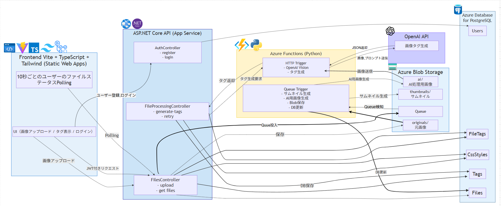

# 画像アップロード & AI タグ生成アプリ  
ユーザーが画像をアップロードすると、  
Azure Functions（Python）＋ OpenAI API が画像を分析し、  
**日本語タグ + Tailwind CSS の bgColor** を自動生成するアプリ。

JWT 認証、Azure Functions、Azure Blob Storage、ASP.NET Core API、  
Vite + TypeScript + Tailwind CSS を組み合わせたフルスタック構成。

---

## Demo

本番環境はこちらからアクセスできます。
利用料金を抑えるためにDBを停止させている場合があるため、利用できないときがあります。

https://green-sky-0aeb51b00.7.azurestaticapps.net/index.html

---

## 機能概要
- ユーザー登録 / ログイン（JWT 認証）
- 画像アップロード（最大 10MB）
- サムネイル自動生成（Azure Functions Queue Trigger）
- OpenAI Vision による画像タグ生成
- Tailwind CSS の bgColor を AI が自動選択
- タグ検索フィルタ
- 10 秒ごとのステータス polling
- エラー時の再処理（Queue 再投入）

---

## アーキテクチャ構成

### ローカル環境
| レイヤー | 技術 |
|---------|------|
| フロント | Vite, Vanilla TypeScript, Tailwind CSS |
| API | ASP.NET Core API |
| DB | PostgreSQL（Docker） |
| AI | Azure Functions（Python） |
| ストレージ | ローカルストレージ（Azurite） |

---

### クラウド環境（Azure）
| レイヤー | 技術 |
|---------|------|
| フロント | Azure Static Web Apps |
| API | Azure App Service（ASP.NET Core API） |
| DB | Azure Database for PostgreSQL |
| AI | Azure Functions（Queue Trigger / HTTP Trigger） |
| ストレージ | Azure Blob Storage |

---
## アーキテクチャ図



---

## DB 設計（EF Core Migrations）

### Users
| Column | Type | Note |
|--------|------|------|
| id | int | PK |
| email | varchar(255) | Unique |
| passwordHash | text | |
| createdAt | datetimeoffset | |

---

### Files
| Column | Type | Note |
|--------|------|------|
| id | int | PK |
| originalFileName | text | |
| uniqueFileName | varchar(255) | |
| fileUrl | text | |
| thumbnailFileUrl | text | nullable |
| aiProcessedFileUrl | text | nullable |
| fileSizeBytes | bigint | |
| contentType | varchar(255) | |
| fileExtension | varchar(50) | |
| status | Status enum | |
| uploadedAt | datetimeoffset | |
| userId | int | FK Users(id) |

---

### Tags
| Column | Type |
|--------|------|
| id | int |
| value | text (Unique) |

---

### CssStyles
| Column | Type |
|--------|------|
| id | int |
| bgColor | varchar(50) |
| tailwindColor | TailwindColor enum |

---

### FileTags（中間テーブル）
| Column | Type |
|--------|------|
| fileId | int |
| tagId | int |
| cssStyleId | int |

---

## Enum 定義

### Status
- processing  
- readyForTag  
- completed  
- error  

### TailwindColor
- Red  
- Blue  
- Green  
- Orange  
- Violet  
- Gray（fallback）

---

##　TailwindColorMapper（C#）
```csharp
public static class TailwindColorMapper
{
    public static TailwindColor FromString(string color)
    {
        return color switch
        {
            "bg-red-700" => TailwindColor.Red,
            "bg-blue-700" => TailwindColor.Blue,
            "bg-green-700" => TailwindColor.Green,
            "bg-orange-800" => TailwindColor.Orange,
            "bg-violet-700" => TailwindColor.Violet,
            _ => TailwindColor.Gray
        };
    }

    public static string ToCss(TailwindColor color)
    {
        return color switch
        {
            TailwindColor.Red => "bg-red-700",
            TailwindColor.Blue => "bg-blue-700",
            TailwindColor.Green => "bg-green-700",
            TailwindColor.Orange => "bg-orange-800",
            TailwindColor.Violet => "bg-violet-700",
            _ => "bg-gray-800"
        };
    }
}
```

---

## SystemPrompt (OpenAI API)
```json
You are an API that analyzes images.
 
Your task:
- Generate image tags and assign a Tailwind CSS background color for each tag.
 
Rules:
- Output must be JSON only (no explanation, no text).
- Each tag must be a short Japanese noun.
- Generate 3 to 5 tag-color pairs.
- Each tag must have exactly one bgColor.
 
Color selection rules:
- bg-red-700: strong, danger, passion, intense objects (e.g., fire, car, action)
- bg-blue-700: calm, water, sky, cool atmosphere
- bg-green-700: nature, plants, outdoor environments
- bg-orange-800: warm, active, friendly things (e.g., animals, people)
- bg-violet-700: mysterious, creative, abstract, night scenes
 
Prefer consistent color mapping:
- Animals → bg-orange-800
- Nature → bg-green-700
- Water/sky → bg-blue-700
- Action objects → bg-red-700
- Night/abstract → bg-violet-700
 
Additional constraints:
- bgColor must be one of the following values ONLY:
  ["bg-red-700","bg-blue-700","bg-green-700","bg-orange-800","bg-violet-700"]
- Do not generate any value outside these options.
- Ensure color selection matches the meaning of each tag.
- Avoid assigning the same color to all tags; try to distribute colors appropriately.
 
Output format:
{
  "items": [
    { "tag": "犬", "bgColor": "bg-orange-800" },
    { "tag": "公園", "bgColor": "bg-green-700" },
    { "tag": "散歩", "bgColor": "bg-blue-700" }
  ]
}
```
##  API 仕様

---

## AuthController

### **POST /api/auth/register**
ユーザー登録を行う。

**リクエスト**
- `email` : string  
- `password` : string  


---

### **POST /api/auth/login**
ログインして JWT を発行する。

**リクエスト**
- `email` : string  
- `password` : string  


---

## FilesController（認証必須）

### **POST /api/files/upload**
画像ファイルをアップロードする。

**内容**
- multipart/form-data（`file`）を受け取る  
- Blob Storage に保存  
- Queue にメッセージ投入（サムネイル生成 & AI 用画像生成）  
- DB にレコード作成  


---

### **GET /api/files**
ユーザーがアップロードしたファイル一覧を取得する。

**レスポンス**
- `fileId`
- `originalFileName`
- `thumbnailUrl` （サムネイル画像が生成されている場合）
- `status`
- `tags`（AI 生成済みの場合）

**備考**
- フロント側の 10 秒 polling で利用

---

## FileProcessingController（認証必須）

### **POST /api/files/{id}/generate-tags**
AI によるタグ生成を開始する。

**条件**
- `status == readyForTag` のときのみ実行可能

**処理内容**
- Azure Functions HTTP Trigger を呼び出し  
- OpenAI API でタグ生成  
- DB にタグを保存  


---

### **POST /api/files/{id}/retry**
エラー状態のファイルを再処理する。

**条件**
- `status == error`

**処理内容**
- Queue に再投入  
- サムネイル生成 & AI 用画像生成を再実行  


## 学んだこと

### 1. Vite + マルチページ構成のビルド落とし穴  
Vite は SPA 前提の設計のため、  
複数 HTML を input に指定する場合は `rollupOptions.input` を正しく設定しないと  
- dist に src が丸ごと入る  
- index.html が生成されない  
- Static Web Apps が 405 を返す  
などの問題が発生する。

**学び:**  
ビルドツールの「デフォルト前提」を理解し、自分の構成に合わせて正しく override する重要性。

---

### 2. Azure Static Web Apps の `app_location` の罠  
`./ImageTagFrontend` と `/ImageTagFrontend` の違いで  
ビルドルートがズレてデプロイが壊れる問題が発生。

**学び:**  
SWA のパス解釈は “絶対パス推奨”。  
CI/CD のパス設定は 1 文字の違いで壊れるため、  
ローカルと GitHub Actions の実行環境の差を理解する必要がある。

---

### 3. Tailwind のブレークポイントは「スマホ用」ではない  
`sm:` は `640px 以上` の意味であり、スマホ用ではない。  
chromeのiPhone の DevTools では `sm:` が発動しない場合がある。  
そのため、lg（`768px以上`）,md（`1024px以上`）属性をを適切につけて検証することでレスポンシブ対応をより適切に実装できる

**学び:**  
Tailwind はモバイルファースト。  
ブレークポイントは「上書き」であり、  
実機と DevTools の挙動差も理解する必要がある。

---

### 4. Azure Functions Queue Trigger の設計思想  
Queue Trigger を使うことで  
- サムネイル生成  
- AI 用画像生成  
- DB 更新  
を非同期で処理できる。

**学び:**  
Web API は「即時レスポンス」、  
Functions は「重い処理・非同期処理」という役割分担が最適。

---

### 5. OpenAI Vision のプロンプト設計の重要性  
AI にタグと Tailwind の bgColor を生成させるため、  
- JSON のみ  
- 色の選択ルール  
- タグの意味と色の対応  
- 出力形式の固定  
などを厳密に指定する必要があった。

**学び:**  
AI は「曖昧に書くと曖昧に返す」。  
プロンプトは API の仕様書レベルで厳密に書くと安定する。

---

### 6. ASP.NET Core 側でのバリデーションの重要性  
AI が返した JSON をそのまま信用せず、  
- 不正な色は Gray にフォールバック  
- タグ数のチェック  
- JSON の構造チェック  
を行うことで安全性を確保。

**学び:**  
外部サービス（AI）は必ず「不正値を返す可能性」を前提に設計する。

---

### 7. DateTimeOffset を使う理由  
`DateTime` ではなく `DateTimeOffset` を使うことで  
- タイムゾーン差  
- サーバー間の時差  
- ログの整合性  
を完全に保証できる。

**学び:**  
分散システムでは「絶対時刻」を扱う必要があり、DateTimeOffset が最も安全。

---

### 8. Blob Storage の課金ポイントの理解  
- SAS 生成 → 無料  
- API polling → 無料  
- 画像アップロード → 数円レベル  
- 画像ダウンロード → 初回のみ課金（キャッシュ後は無料）

**学び:**  
クラウド課金は「何が無料で何が有料か」を理解すると安心して設計できる。

---

### 9. フロントの UI 最適化（スマホ対応）  
- `w-full` は広がりすぎる  
- `max-w-[90%]` + `mx-auto` が最適  
- タグバッジは `text-sm sm:text-xs` のようにスマホと PC でサイズを切り替えると綺麗  

**学び:**  
Tailwind は「モバイルファースト」で考えると  
UI が自然に整う。

---

### 10. 全体アーキテクチャの役割分担  
- Static Web Apps → フロント  
- App Service → API  
- Functions → 重い処理  
- Blob Storage → 画像  
- PostgreSQL → メタデータ  
- Queue → 非同期処理

**学び:**  
Azure の各サービスを「適材適所」で使うとシンプルでスケールしやすい構成になる。
